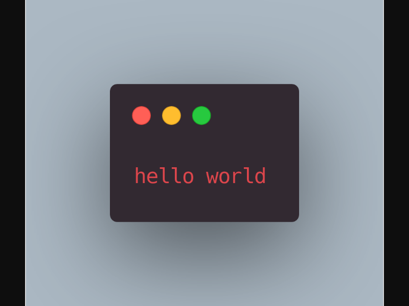

# carbon-node-api

A simple node-puppeteer API to get a carbon.sh code image.

| Param | Type   | Default   | Description                 |
|-------|--------|-----------|-----------------------------|
| code (required) | string |       | Code used in the screenshot |
| theme | string | Hopscotch | Visual code theme           |
|       |        |           |                             |

## GET `/`

Params are url-encoded:

`
https://carbon-node-api.herokuapp.com/?code=hello%20world&theme=Monakai
`

## Response

Deploy your own to Heroku in one-click:

---

Inspiration from Sumanjay's Python version: https://github.com/cyberboysumanjay/Carbon-API